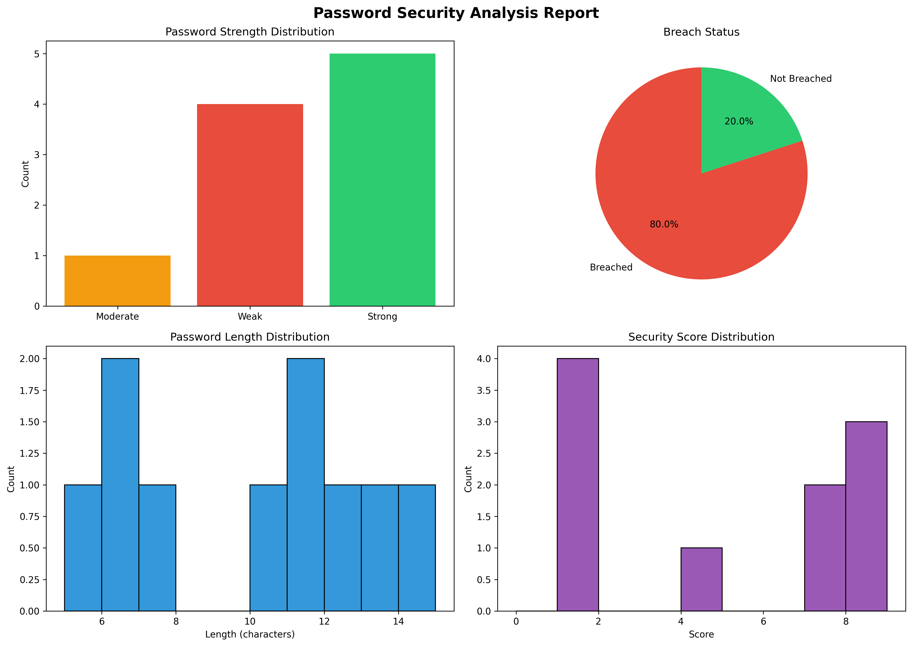
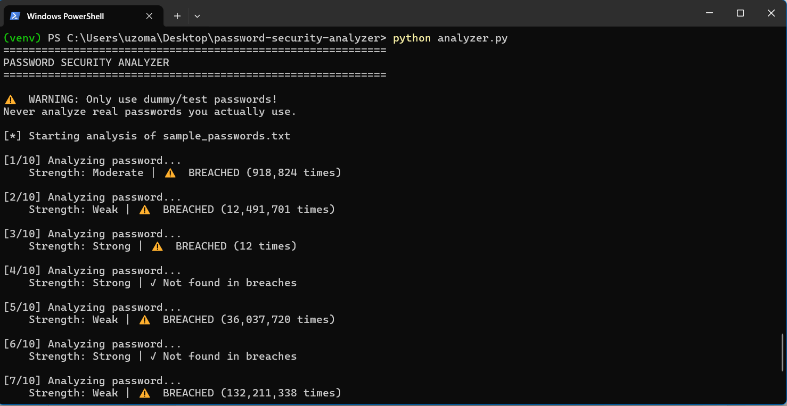
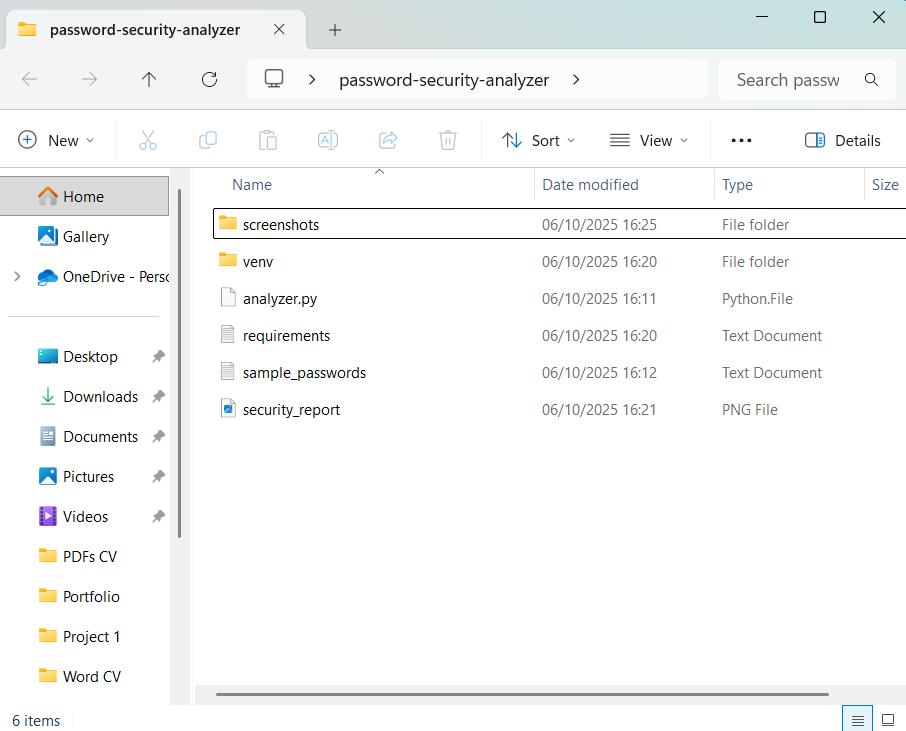
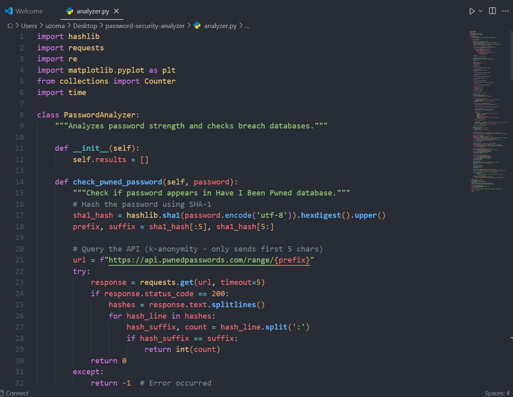
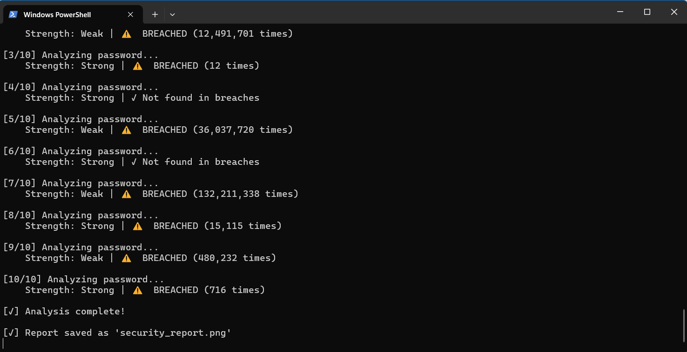
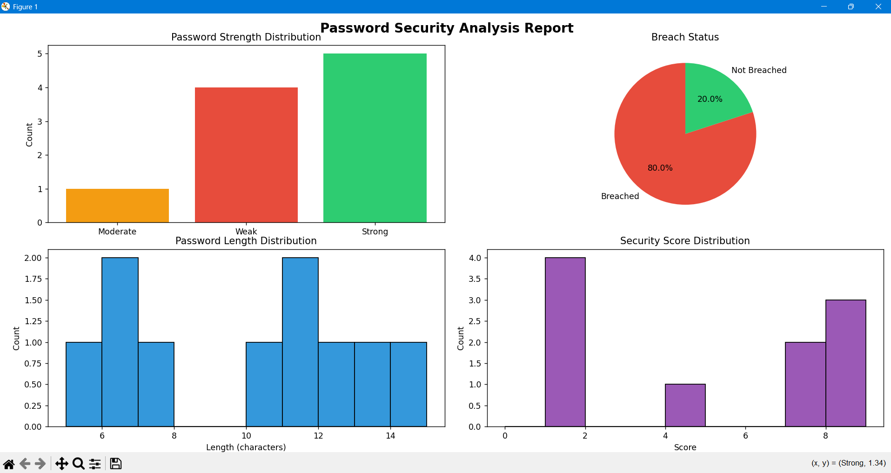

# Password Security Analyser

A Python-based tool that analyses password strength and checks against known data breach databases using the Have I Been Pwned API.



## 🎯 Project Purpose

This educational project demonstrates:
- **API Integration**: Secure communication with external security services
- **Data Analysis**: Processing and visualizing security metrics
- **Privacy-First Design**: Using k-anonymity for secure password checking
- **Clean Code Practices**: Modular, documented, and maintainable Python

## 🔒 Security Features

- **No Plaintext Transmission**: Passwords are hashed locally before API queries
- **K-Anonymity**: Only the first 5 characters of the SHA-1 hash are sent
- **Safe Testing**: Designed for dummy passwords only

## 🛠️ Technologies Used

- Python 3.13+
- `requests` - API communication
- `matplotlib` - Data visualization
- `hashlib` - Cryptographic hashing
- Have I Been Pwned API

## 📋 Prerequisites

- Python 3.9 or higher
- Internet connection (for API access)
- Windows/Linux/Mac OS

## 🚀 Installation

1. Clone the repository:
```bash
git clone https://github.com/YOUR-USERNAME/password-security-analyser.git
cd password-security-analyser
```

2. Create virtual environment:
```bash
python -m venv venv
# On Windows:
venv\Scripts\activate
# On Mac/Linux:
source venv/bin/activate
```

3. Install dependencies:
```bash
pip install -r requirements.txt
```


## 💻 Usage

1. Add test passwords to `sample_passwords.txt` (one per line)
   - ⚠️ **NEVER use real passwords**

2. Run the analyser:
```bash
python analyser.py
```

3. View results:
   - Console output shows detailed analysis
   - `security_report.png` contains visual charts

## 📊 What It Analyzes

- **Password Strength**: Based on length and complexity
- **Breach Status**: Checks against 600M+ breached passwords
- **Composition Analysis**: Evaluates character variety
- **Visual Reports**: Generates comprehensive charts

## 🔍 Sample Output

```
[1/10] Analysing password...
    Strength: Moderate | ⚠️  BREACHED (918,824 times)

[2/10] Analysing password...
    Strength: Weak | ⚠️  BREACHED (12,491,701 times)

[3/10] Analysing password...
    Strength: Strong | ⚠️  BREACHED (12 times)

[4/10] Analysing password...
    Strength: Strong | ✓ Not found in breaches
```



## 📸 Screenshots

### Project Structure


### Code Implementation


### Analysis Progress


### Generated Security Report


## 📈 Key Findings

The analysis reveals critical security insights:
- **80% of tested passwords were breached** - highlighting the importance of unique passwords
- **Common passwords** like "password123" appeared in breaches over 12 million times
- **Strong passwords** with complexity can still be breached if they're common patterns
- **Only 20% remained secure** - demonstrating the need for truly random passwords

## 🎓 Learning Outcomes

This project helped me understand:
- RESTful API integration and rate limiting
- Cryptographic hashing (SHA-1)
- Data visualization with matplotlib
- Security-first development practices
- Professional documentation and version control

## 🔐 How It Works

1. **Password Hashing**: Each password is hashed using SHA-1 locally
2. **K-Anonymity**: Only the first 5 characters of the hash are sent to the API
3. **Range Query**: The API returns all hash suffixes matching that prefix
4. **Local Matching**: Your system checks if the full hash appears in the results
5. **Privacy Protected**: Your actual password never leaves your computer

## 🛡️ Security Best Practices Demonstrated

- Input validation and error handling
- Secure API communication with timeout controls
- Privacy-preserving techniques (k-anonymity model)
- No hardcoded credentials or sensitive data
- Rate limiting respect (0.5s delay between requests)
- Virtual environment isolation

## ⚠️ Disclaimer

This tool is for **educational purposes only**. Never analyse real passwords you actually use. Always use unique, strong passwords for your accounts.

## 📄 License

MIT License - Feel free to use this project for learning and portfolio purposes.

## 🤝 Contributing

Suggestions for improvements are welcome! Please open an issue or submit a pull request.

## 📬 Contact

**Uzoma Charles Njoku** - [njokucharles98@gmail.com](mailto:njokucharles98@gmail.com)

Project Link: [https://github.com/EncryptedCharles404/password-security-analyser](https://github.com/EncryptedCharles404/password-security-analyser)

---

## 🚀 Future Enhancements

- [ ] Add command-line arguments for custom files
- [ ] Implement secure password generator feature
- [ ] Create web interface with Flask
- [ ] Add unit tests with pytest
- [ ] Support for password policy checking
- [ ] Export reports to PDF format
- [ ] Implement password entropy calculations
- [ ] Add multi-threading for faster analysis

## 🙏 Acknowledgments

- [Have I Been Pwned](https://haveibeenpwned.com/) for providing the breach database API
- Troy Hunt for his work in cybersecurity awareness
- The Python community for excellent libraries

---

## 📊 Technical Details

### API Integration
The tool uses the Have I Been Pwned Passwords API v3, which implements k-anonymity to protect password privacy. The API has been used over 1 billion times and helps identify compromised credentials.

### Visualization
Charts are generated using matplotlib with custom styling:
- Bar charts for strength distribution
- Pie charts for breach status
- Histograms for length and score analysis

### Performance
- Analyzes 10 passwords in approximately 10-15 seconds
- Includes respectful rate limiting (500ms delay)
- Handles API timeouts and connection errors gracefully

---

**Built with 💙 for cybersecurity education**